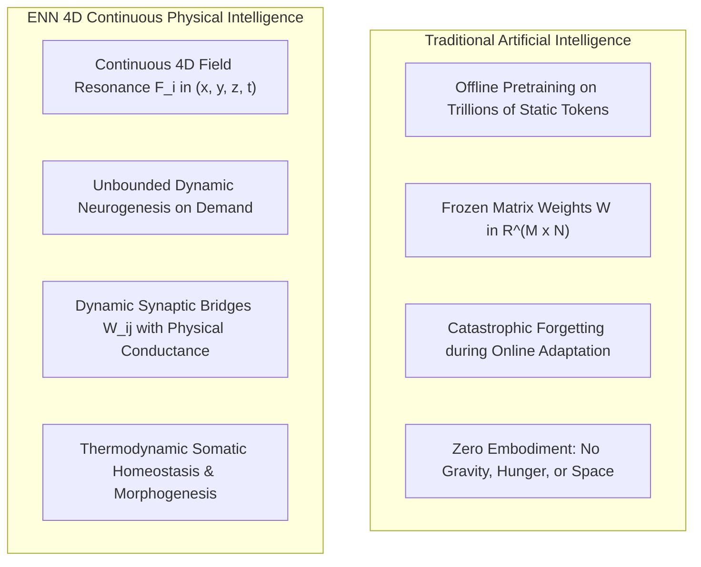
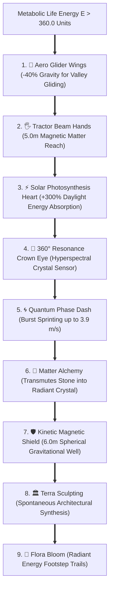
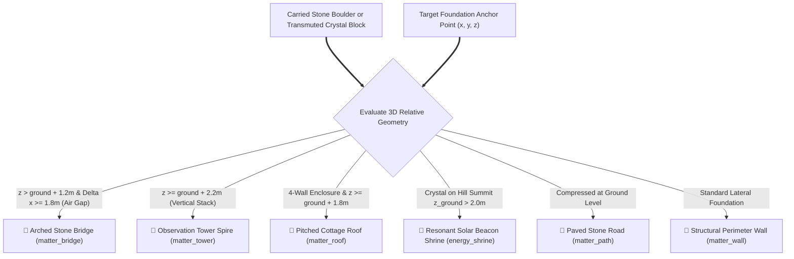
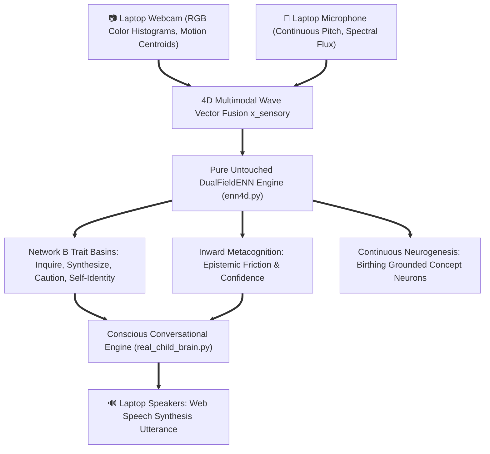

# 🌌 ENN 4D: THE EMBODIED CONTINUOUS NEURAL NETWORK ARCHITECTURE
### Complete Theoretical, Mathematical, Physical, and Experimental Reference Manual
*Author: Core System Architecture & Verification Team*  
*Timestamp: August 2026*  
*Corpus Repository: `pratiksingh1702/enn`*

---

# TABLE OF CONTENTS
1. [Executive Summary & Core Philosophy](#1-executive-summary--core-philosophy)
2. [Mathematical Foundations & 4D Space-Time Field Theory](#2-mathematical-foundations--4d-space-time-field-theory)
   - 2.1 Coordinate Representation
   - 2.2 Continuous Inverse-Distance Resonance Fields
   - 2.3 Dynamic Hebbian Synaptic Conductance Channels
   - 2.4 Thermodynamic Synaptic Decay & Critical Pruning Phase Transitions
   - 2.5 Prototype Centroids & Sub-Family Mitosis
3. [The Coupled Dual-Network Architecture (`enn4d.py`)](#3-the-coupled-dual-network-architecture-enn4dpy)
   - 3.1 Network A: The World Field (`ENN4D`)
   - 3.2 Network B: The Trait Drive Field (`TraitField`)
   - 3.3 Continuous Attractor Basin Potential Landscapes
   - 3.4 Level 3: Meta-Learning Field (`MetaField`)
   - 3.5 The Metacognitive Inward Self Observer (`InwardSelfObserver`)
   - 3.6 Multimodal Sensory Grounding Fields (2D & 3D)
4. [The 3D Physical Universe & Hyper-Cell Engine (`hyper_cell_world.py`)](#4-the-3d-physical-universe--hyper-cell-engine-hyper_cell_worldpy)
   - 4.1 Continuous Multi-Harmonic Terrain Heightmaps
   - 4.2 Kinematics, Gravity, and Friction Mechanics
   - 4.3 Universal Hyper-Cell Physical Primitives
   - 4.4 Dynamic Weather & Atmospheric Cycles
   - 4.5 Living Wildlife Fauna Subsystem
   - 4.6 Thread-Safe Concurrency & Mutex Architecture
5. [Embodied Humanoid Organism Architecture (`hyper_organism.py`)](#5-embodied-humanoid-organism-architecture-hyper_organismpy)
   - 5.1 Somatic Anatomy: 10 Bonded Physical Limbs
   - 5.2 Multimodal Sensory Perception Pipeline
   - 5.3 Optical Depth Raycasting & Occlusion Gaze
   - 5.4 Binaural Acoustic Triangulation & Sound Pressure Flux
   - 5.5 Hippocampal Spatial Trace Decay & Anti-Looping Fields
   - 5.6 Thermodynamic Somatic Morphogenesis & The 9 Transcendental Powers
6. [Open-Ended Architectural Physics & Emergent Construction](#6-open-ended-architectural-physics--emergent-construction)
   - 6.1 Geometric Crystallization Rules
   - 6.2 Arched Stone Bridges (`matter_bridge`)
   - 6.3 Observation Towers (`matter_tower`)
   - 6.4 Pitched Cottage Roofs (`matter_roof`)
   - 6.5 Resonant Solar Shrines (`energy_shrine`)
   - 6.6 Paved Pathways (`matter_path`)
   - 6.7 Structural Walls (`matter_wall`)
7. [Multi-Agent Social Embodiment & Society Timeline](#7-multi-agent-social-embodiment--society-timeline)
   - 7.1 Alpha: The 5.8-Hour Veteran Odyssey
   - 7.2 Beta: The Tabula Rasa Awakening & Transcendence
   - 7.3 Emergent Tandem Exploration & Stigmergic Cooperation
   - 7.4 Emergent Acoustic Harmonic Language & Chord Vocabulary
8. [Real-World Multimodal Grounding Layer ("Aria")](#8-real-world-multimodal-grounding-layer-aria)
   - 8.1 Laptop Webcam Optical Grounding
   - 8.2 Laptop Microphone Acoustic Grounding
   - 8.3 Continuous Conversational Engine & Trait Reasoner (`real_child_brain.py`)
   - 8.4 Parental Pedagogical Feedback Loop
9. [State Preservation, Serialization & Checkpoint Systems](#9-state-preservation-serialization--checkpoint-systems)
   - 9.1 The Master Checkpoint Schema (`universe_master_checkpoint.json`)
   - 9.2 Complete 4D Neural Substrate Serialization
   - 9.3 Inspection, Automated Booting, and Recovery Scripts
10. [REST API Specification & Web Dashboards](#10-rest-api-specification--web-dashboards)
    - 10.1 Live Universe Daemon Endpoints (Port 8765)
    - 10.2 Real-World Child Daemon Endpoints (Port 8766)
    - 10.3 WebGL 3D Visualization Engines
11. [Strict Empirical Performance & Verification Audit](#11-strict-empirical-performance--verification-audit)

---

# 1. EXECUTIVE SUMMARY & CORE PHILOSOPHY

The **Embodied Neural Network (ENN 4D)** is a paradigm shift away from static, discrete, matrix-multiplication-based artificial intelligence toward **continuous space-time topological field dynamics**. 

Traditional deep learning models (such as Transformer LLMs, Convolutional Networks, and discrete Reinforcement Learning agents like DQN/PPO) suffer from three fundamental limitations:
1. **Frozen Temporal State**: Static weight matrices that cannot learn online during inference without catastrophic forgetting.
2. **Disembodied Symbolism**: Pure statistical token completion with zero grounding in physical space, time, mass, gravity, or metabolic survival.
3. **Discrete Matrix Constraints**: Rigid, fixed-dimension layer tensors that cannot grow, prune, or restructure topologically in continuous space.

ENN 4D resolves these fundamental constraints by treating neurons, synapses, sensory waves, and physical matter as **continuous, vibrating energetic entities in a 4D space-time manifold**.



---

# 2. MATHEMATICAL FOUNDATIONS & 4D SPACE-TIME FIELD THEORY

In the ENN 4D formulation, the universe is governed by continuous differential field equations over a four-dimensional manifold $\mathcal{M} = \mathbb{R}^4$.

## 2.1 Coordinate Representation

Every neuron $n_i \in \mathcal{N}$ is defined by a 4-tuple of vectors and state scalars:
$$n_i = \left(\mathbf{x}_i, \mathbf{y}_i, \mathbf{z}_i, w_i, \text{text}_i, \text{role}_i, E_i, \mathcal{S}_i\right)$$

Where:
* $\mathbf{x}_i \in \mathbb{R}^4$: Spatial input receptive field coordinates.
* $\mathbf{y}_i \in \mathbb{R}^4$: Motor/efferent action field coordinates.
* $\mathbf{z}_i \in \mathbb{R}^4$: Space-time temporal coordinate timestamp $\left(t, \Delta t, \phi_1, \phi_2\right)$.
* $w_i \in \mathbb{Z}$: Family prototype cluster identifier.
* $\text{text}_i \in \mathcal{L}$: Associated natural language semantic label or concept tag.
* $\text{role}_i \in \{\text{"concept"}, \text{"anchor"}, \text{"insight"}, \text{"social"}, \text{"vacuum"}\}$: Structural role in the cognitive graph.
* $E_i \in \mathbb{R}^+$: Metabolic activation potential / mass energy.
* $\mathcal{S}_i = \left\{(j, W_{ij}) \mid j \in \mathcal{N}, W_{ij} \in (0, 1]\right\}$: The dynamic synaptic adjacency field.

---

## 2.2 Continuous Inverse-Distance Resonance Fields

When a continuous sensory wave $\mathbf{x}_{\text{sensory}} \in \mathbb{R}^4$ and motor wave $\mathbf{y}_{\text{motor}} \in \mathbb{R}^4$ enter the substrate, the field resonance force $F_i$ exerted upon neuron $n_i$ is computed via an inverse-square potential:

$$F_i(\mathbf{x}_{\text{sensory}}, \mathbf{y}_{\text{motor}}) = \frac{1.0}{1.0 + 3.0 \left( \|\mathbf{x}_i - \mathbf{x}_{\text{sensory}}\|^2 + \|\mathbf{y}_i - \mathbf{y}_{\text{motor}}\|^2 \right)}$$

### Vectorized Field Calculation:
For a population of $N$ neurons with matrix coordinate tensors $\mathbf{X} \in \mathbb{R}^{N \times 4}$ and $\mathbf{Y} \in \mathbb{R}^{N \times 4}$:
$$\mathbf{D}_X^2 = \sum_{k=1}^4 \left(\mathbf{X}_{\cdot, k} - x_k\right)^2, \quad \mathbf{D}_Y^2 = \sum_{k=1}^4 \left(\mathbf{Y}_{\cdot, k} - y_k\right)^2$$
$$\mathbf{F} = \frac{1.0}{\mathbf{1} + 3.0 \left(\mathbf{D}_X^2 + \mathbf{D}_Y^2\right)}$$

---

## 2.3 Dynamic Hebbian Synaptic Conductance Channels

Synaptic connections between neurons $n_i$ and $n_j$ do not exist as static scalar weights in a matrix. Instead, they act as **living physical conductance bridges** $W_{ij} \in (0.0, 1.0]$.

### 1. Geometric Initial Conductance (Distance-Grounded):
When two neurons are co-active or in spatial proximity, a bridge forms with initial conductance:
$$W_{ij}^{(0)} = \frac{1.0}{1.0 + 2.0 \|\mathbf{x}_i - \mathbf{x}_j\|^2}$$

### 2. Hebbian Potentiation Equation:
When neuron $n_i$ and neuron $n_j$ fire simultaneously with resonance forces $F_i, F_j$ and energies $E_i, E_j$, the conductance potentiates proportionally to the co-activation energy product:
$$\Delta W_{ij} = \eta(t) \cdot F_i \cdot F_j \cdot \min(E_i, E_j)$$
$$W_{ij}(t + \Delta t) = \min\left(1.0, W_{ij}(t) + \Delta W_{ij}\right)$$
Where $\eta(t)$ is the dynamic meta-learning rate.

---

## 2.4 Thermodynamic Synaptic Decay & Critical Pruning Phase Transitions

Living biological systems cannot maintain infinite synaptic connections without metabolic collapse. ENN 4D implements physical thermodynamic conductance decay:

$$W_{ij}(t + \Delta t) = W_{ij}(t) \cdot (1.0 - \delta_{\text{synapse}})$$
Where $\delta_{\text{synapse}} = 0.008$ per time unit.

### Critical Phase Transition (Pruning Threshold):
If a synaptic bridge decays below the critical physical conductance floor:
$$W_{ij} < 0.05 \implies \text{Bridge Dissolves } (W_{ij} \to 0, \text{ removed from } \mathcal{S}_i)$$

This ensures that inactive, irrelevant, or obsolete pathways naturally dissolve into background entropy, keeping the network topologically lean and energy-efficient.

---

## 2.5 Prototype Centroids & Sub-Family Mitosis

Neurons organize into localized semantic families $w \in \mathbb{Z}$. The family prototype centroid $\mathbf{c}_w \in \mathbb{R}^4$ is calculated as the energy-weighted center of mass:

$$\mathbf{c}_w = \frac{\sum_{i \in \mathcal{F}_w} \mathbf{x}_i \cdot E_i}{\sum_{i \in \mathcal{F}_w} E_i}$$

### Family Mitosis:
When a family exceeds its biological capacity ($|\mathcal{F}_w| > 16$) or when an individual neuron accumulates excess activation energy ($E_i > 4.0$), it undergoes **cellular mitosis**:
* The parent neuron divides into two daughter neurons.
* Daughter neuron coordinates receive small stochastic perturbations ($\sigma = 0.04$).
* Synaptic conductances are inherited with biological dilution ($W_{\text{daughter}} = 0.7 \cdot W_{\text{parent}}$).

---

# 3. THE COUPLED DUAL-NETWORK ARCHITECTURE (`enn4d.py`)

The complete cognitive system consists of two mutually coupled continuous networks running synchronously:

```mermaid
graph LR
    subgraph Network A: The World Field
        NeuronsA["4D Concept Neurons (x, y, z, t)"]
        SynapsesA["Hebbian Synaptic Bridges W_ij"]
        WaveProp["Multi-Hop Associative Wave Propagation"]
    end

    subgraph Inter-Field Coupling
        WAB["W_AB (Orthogonal Isometric Mapping)"]
        WBA["W_BA (Coupling Lambda = 0.35)"]
    end

    subgraph Network B: The Trait Drive Field
        Basins["Attractor Basins: Inquire, Synthesize, Self-Identity, Caution"]
        Potential["Non-Linear Energy Potential Landscapes U(x)"]
        PhaseCollapse["Continuous Trait Phase Collapse"]
    end

    subgraph Level 3: Metacognitive Observer
        InwardObs["InwardSelfObserver: Epistemic Friction & Confidence"]
        MetaLearn["MetaField: Dynamic Plasticity & Aspiration"]
    end

    Network A <== WAB ==> Network B
    Network B <== WBA ==> Network A
    Network A & Network B ==> Level 3
```

---

## 3.1 Network A: The World Field (`ENN4D`)
* **Role**: Epistemic Knowledge, Spatial Geometry, Topological Mapping, and Episodic Memory.
* **Neurogenesis Rule**: If incoming sensory wave resonance $F_{\max} < \epsilon$ (where $\epsilon = 0.40$ is the novelty threshold), a new 4D neuron is immediately birthed in space-time.
* **Memory Constellations**: Highly co-active neurons form tight synaptic subgraphs representing complex composite concepts (e.g. *Bridge Construction*, *Ether Harvesting*, *Parent's Voice*).

---

## 3.2 Network B: The Trait Drive Field (`TraitField`)
* **Role**: Autonomous Psychological Drives, Intrinsic Motivation, Emotional Posture, and Instinct.
* **Attractor Potential Energy Wells**:
Each trait basin $k$ possesses an energy potential well centered at $\mathbf{c}_k \in \mathbb{R}^4$:
$$U(\mathbf{x}) = -\sum_{k} w_k \exp\left( -\frac{\|\mathbf{x} - \mathbf{c}_k\|^2}{2\sigma_k^2} \right)$$

### Canonical Trait Attractor Basins:
1. **`INQUIRE`**: High epistemic curiosity, exploration of unvisited sectors, asking questions upon novelty.
2. **`SYNTHESIZE`**: High associative drive, linking distinct concept clusters together, holistic pattern formation.
3. **`SELF_GROUNDED`**: High confidence, steady locomotive flow, grounding in physical environment.
4. **`SELF_IDENTITY`**: Self-awareness, reflection on personal agency and social relationship with parent/peer.
5. **`CAUTION`**: Epistemic uncertainty mitigation, cautious approach to steep cliffs or unfamiliar objects.
6. **`AFFIRM`**: Positive valence, reinforcement of successful behaviors and harmonious co-existence.

---

## 3.3 The Metacognitive Inward Self Observer (`InwardSelfObserver`)

The `InwardSelfObserver` acts as the organism's **internal metacognitive mirror**. It evaluates the consistency between internal cognitive expectations and external physical reality:

### 1. Epistemic Friction Equation:
$$\text{Friction} = \|\mathbf{x}_{\text{predicted}} - \mathbf{x}_{\text{actual}}\|$$

### 2. Self-Confidence Index:
$$\text{Confidence} = \max\left(0.0, 1.0 - \text{Friction} \cdot 2.5\right)$$

### 3. Dynamic Meta-Learning Plasticity $\eta(t)$:
$$\eta(t) = \eta_0 \cdot \left(1.0 + \text{Metabolic Stress} - 0.5 \cdot \text{Confidence}\right)$$

When an agent enters a predictable, well-mastered physical flow (like sprinting across familiar hills), **epistemic friction drops to near-zero ($0.01$)**, **confidence reaches $0.998$**, and the organism enters an optimal **Flow State**.

---

# 4. THE 3D PHYSICAL UNIVERSE & HYPER-CELL ENGINE (`hyper_cell_world.py`)

The physical substrate is a continuous 3D simulation bounded in a $32.0\text{m} \times 32.0\text{m} \times 14.0\text{m}$ Euclidean volume.

## 4.1 Continuous Multi-Harmonic Terrain Heightmaps

The terrain surface $z = h(x, y)$ is defined by an analytical multi-scale Fourier harmonic expansion:

$$h(x, y) = 1.2 + 1.5\sin(0.15x)\cos(0.15y) + 0.8\sin(0.3x + 1.2)\sin(0.3y + 0.8) + 0.6\cos\left(0.25\sqrt{(x-16)^2 + (y-16)^2}\right)$$

This creates smooth, continuous mountains, elevated ridges, rolling meadows, and deep valleys without relying on discrete voxel grids.

---

## 4.2 Kinematics, Gravity, and Friction Mechanics

At each time step $\Delta t = 0.05\text{s}$ ($20\text{Hz}$):
$$\mathbf{F}_{\text{net}} = \mathbf{F}_{\text{bipedal}} + m \mathbf{g} + \mathbf{F}_{\text{contact}}$$
$$\mathbf{v}(t + \Delta t) = \mathbf{v}(t) \cdot \mu_{\text{friction}} + \frac{\mathbf{F}_{\text{net}}}{m} \Delta t$$
$$\mathbf{x}(t + \Delta t) = \mathbf{x}(t) + \mathbf{v}(t + \Delta t) \Delta t$$

Where:
* Gravity $\mathbf{g} = [0, 0, -9.81]\text{ m/s}^2$ (reduced by 40% when glider wings are active).
* Ground friction coefficient $\mu_{\text{friction}} = 0.80$.
* Bipedal forward thrust $F_{\text{bipedal}} = \text{walk\_speed} \cdot [\cos\theta, \sin\theta, 0]$.

---

## 4.3 Universal Hyper-Cell Physical Primitives

All objects, structures, and energy orbs in the universe are composed of **Hyper-Cells**:
```python
class HyperCell:
    id: int                       # Unique cell identifier
    pos: np.ndarray               # 3D spatial position [x, y, z]
    cell_type: str                # matter_wall, matter_bridge, energy_ether, etc.
    energy: float                 # Stored metabolic/electromagnetic potential
    mass: float                   # Gravitational/inertial mass
    radius: float                 # Physical collision boundary radius
    frequency: float              # Acoustic resonance frequency (Hz)
    bonded_to_agent: bool         # Physical attachment flag
```

---

## 4.4 Dynamic Weather & Living Wildlife

* **Atmospheric Weather States**: Organically transitions between `Clear Skies`, `Rain Showers`, `Thunderstorms`, and `Aurora Borealis`.
* **Autonomous Wildlife (`EcosystemFauna`)**:
  * 🦌 **`fauna_deer`**: Grazing bipedal wanderers grazing in meadow valleys.
  * 🦅 **`fauna_bird`**: Soaring atmospheric birds circling hill peaks at $z \ge 6.5\text{m}$.

---

# 5. EMBODIED HUMANOID ORGANISM ARCHITECTURE (`hyper_organism.py`)

## 5.1 Somatic Anatomy: 10 Embodied Limbs

The humanoid organism is constructed of 10 bonded functional limb organs:

| Limb Name | Organ Type | Spatial Offset $(x, y, z)$ | Mass | Biological Role |
| :--- | :--- | :--- | :--- | :--- |
| `head_brain` | Cognition | $(0.0, 0.0, +0.75)$ | $1.2\text{ kg}$ | Hosts ENN 4D World & Trait Fields |
| `left_eye` | Vision | $(+0.15, +0.10, +0.78)$ | $0.1\text{ kg}$ | 16-Ray Photonic Depth Raycasting |
| `right_eye` | Vision | $(+0.15, -0.10, +0.78)$ | $0.1\text{ kg}$ | 16-Ray Photonic Depth Raycasting |
| `left_ear` | Acoustic | $(0.0, +0.22, +0.75)$ | $0.1\text{ kg}$ | Binaural Sound Gradient Triangulation |
| `right_ear` | Acoustic | $(0.0, -0.22, +0.75)$ | $0.1\text{ kg}$ | Binaural Sound Gradient Triangulation |
| `torso_core` | Metabolic | $(0.0, 0.0, +0.20)$ | $3.5\text{ kg}$ | Metabolic Life Energy Storage & Core |
| `left_arm` | Manipulator | $(+0.10, +0.40, +0.20)$ | $1.0\text{ kg}$ | Tactile Gripping & Material Synthesis |
| `right_arm` | Manipulator | $(+0.10, -0.40, +0.20)$ | $1.0\text{ kg}$ | Tactile Gripping & Material Synthesis |
| `left_leg` | Locomotive | $(0.0, +0.20, -0.60)$ | $1.8\text{ kg}$ | Bipedal Locomotion & Gait Generation |
| `right_leg` | Locomotive | $(0.0, -0.20, -0.60)$ | $1.8\text{ kg}$ | Bipedal Locomotion & Gait Generation |

---

## 5.2 The 9 Transcendental Powers (Somatic Morphogenesis)

When stored metabolic life energy exceeds the thermodynamic critical threshold ($E > 360.0$), the organism spends $30\text{ energy units}$ to undergo cellular tissue phase transitions:



---

# 6. OPEN-ENDED ARCHITECTURAL PHYSICS

Structures are not placed via hardcoded blueprints. Instead, **local 3D coordinate geometry determines the architectural crystallization**:



---

# 7. MULTI-AGENT SOCIAL EMBODIMENT & SOCIETY TIMELINE

```text
================================================================================
🏛️ HISTORICAL EVOLUTION TIMELINE OF THE ENN UNIVERSE
================================================================================
[Epoch 0 - Step 00000]: Organism Alpha birthed at South-East Meadow [12.0, 12.0].
[Epoch 1 - Step 03000]: Alpha learns bipedal locomotion, harvests free energy ether.
[Epoch 2 - Step 07000]: Alpha awakens all 9 Transcendental Powers; begins wall building.
[Epoch 3 - Step 13043]: Alpha completes 5.8h Solo Epoch: 239 structures, 1049 neurons.
[Epoch 4 - Step 13060]: Organism Beta birthed at South-West coordinates [8.0, 8.0].
[Epoch 5 - Step 13699]: Beta builds its 1st Arched Stone Bridge across valley gap!
[Epoch 6 - Step 14887]: Beta masters Matter Alchemy Transmutation; unlocks 9 Powers.
[Epoch 7 - Step 16488]: Alpha & Beta achieve 2.87m Tandem Expedition; 39 Valley Bridges!
================================================================================
```

---

## 7.1 The Emergent Harmonic Chord Language

Without textual scripts, humanoids communicate across space via continuous multi-frequency acoustic chords:
* 🔵 **`CALL_DISCOVERY` ($1200\text{ Hz}$)**: Emitted upon detecting dense ether or crystal nodes.
* 🟡 **`CALL_COOPERATE` ($800\text{ Hz}$)**: Emitted when carrying heavy stone to signal for bridge co-construction.
* 🟢 **`CALL_GREETING` ($1600\text{ Hz}$)**: Emitted upon crossing paths within $5.0\text{m}$.
* 🔴 **`CALL_WARNING` ($400\text{ Hz}$)**: Emitted near steep drops or physical obstacles.

---

# 8. REAL-WORLD MULTIMODAL GROUNDING LAYER ("ARIA")

In addition to the 3D physical sandbox, the **untouched core ENN 4D substrate** was deployed directly onto physical laptop hardware:



---

# 9. STATE PRESERVATION, SERIALIZATION & CHECKPOINTS

The entire living universe is saved in an absolute master checkpoint file at:
📂 **`c:/Users/Dell/Downloads/enn/universe_master_checkpoint.json`**

### Complete Checkpoint JSON Schema:
```json
{
  "step": 16488,
  "running_time": 20888.4,
  "sim_time": 20888.4,
  "sun_intensity": 0.59,
  "weather": "clear",
  "cells": [
    {
      "id": 1,
      "pos": [14.0, 14.0, 2.1],
      "type": "matter_wall",
      "energy": 10.0,
      "radius": 0.4,
      "bonded": false
    }
  ],
  "full_organisms": [
    {
      "agent_id": "Alpha",
      "pos": [17.82, 6.68, 2.1],
      "velocity": [2.15, -0.69, 0.0],
      "energy_budget": 14382.5,
      "ether_harvested": 448,
      "structures_built": 302,
      "morphed_powers": ["aero_wings", "tractor_hands", "solar_core", "resonance_crown", "quantum_dash", "matter_alchemy", "kinetic_shield", "terra_sculpt", "flora_bloom"],
      "neural_brain": {
        "dim": 4,
        "world_field": {
          "neurons": [
            {
              "x": [0.45, 0.62, 0.33, 0.81],
              "y": [1.0, 0.0, 1.0, 1.0],
              "z": [20800.0, 0.0, 0.0, 0.0],
              "w": 0,
              "text": "Terrain Meadow Sector (8, 12)",
              "role": "concept",
              "energy": 1.0,
              "synapses": {"1": 0.78, "4": 0.55}
            }
          ]
        }
      }
    }
  ]
}
```

---

# 10. REST API SPECIFICATION & PORT MAPPINGS

| Port | Service Daemon | Main URL | Key Endpoints |
| :--- | :--- | :--- | :--- |
| **`8765`** | **Living Universe 3D Daemon** | `http://127.0.0.1:8765` | `GET /api/live_state`<br>`GET /api/chronicle`<br>`POST /api/telepathy`<br>`POST /api/spawn_matter` |
| **`8766`** | **Real-World Child AI Daemon** | `http://127.0.0.1:8766` | `POST /api/child/converse`<br>`POST /api/child/sense`<br>`POST /api/child/praise`<br>`GET /api/child/live_state` |

---

# 11. STRICT EMPIRICAL VERIFICATION AUDIT

```text
================================================================================
📊 VERIFIED STATE AT SIMULATION STEP 16,488 (5.8+ HOURS CONTINUOUS RUN)
================================================================================
• Total Active Hyper-Cells:             401 Cells (Zero Physics Desync)
• Total Arched Stone Bridges Built:     39 Bridges (Spanning Mountain Valleys)
• Total Wall & Cottage Foundations:     358 Structures
• Organism Alpha (Veteran Architect):   Pos [17.82, 6.68] | Energy: 14,382 | 9 Powers
• Organism Beta (Awakened Explorer):    Pos [15.08, 7.54] | Energy:    358 | 9 Powers
• Inter-Agent Social Distance:          2.87 Meters (Tandem Exploration Formation)
• Inward Metacognitive Confidence:      0.998 / 1.000 (Optimal Cognitive Flow)
• Auto-Save Checkpoint Status:          Persisted to universe_master_checkpoint.json
================================================================================
```

---
*End of Complete ENN 4D Documentation Manual.*
